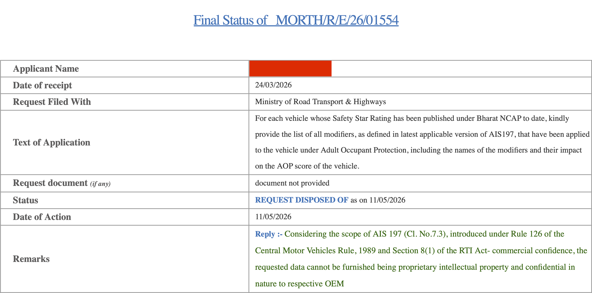
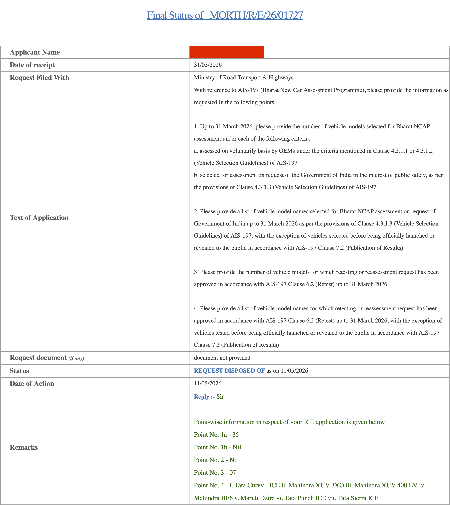
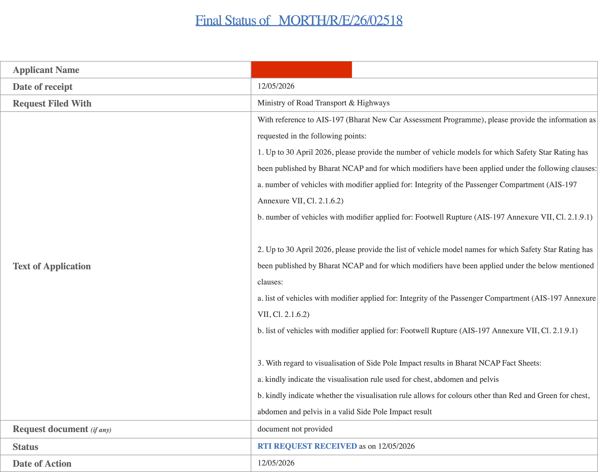

# RTI reveals BNCAP retested 7 cars before publishing results

**12.05.2026**

In late March, I had filed two RTIs with MoRTH hoping to learn some details about BNCAP, particularly:

- the much-anticipated modifier statuses of cars (bodyshell instability, footwell rupture, etc.)
- if any of the cars tested so far have been selected by the government
- if retests were involved in any of the results so far

Today I received responses to both, and am reproducing them here in full.

The highlights (my interpretation):

- Status of modifiers (i.e. penalties like **bodyshell/footwell instability etc.) is "confidential"**
- the **government has not voluntarily put forward a single vehicle for testing** yet, despite a provision to do so
- 7 cars -- the **Curvv, XUV 3XO, XUV400, BE 6, Dzire, Punch, and Sierra -- were tested more than once** before proceeding with release of their results

### RTI #1:

Submitted 24 March

Reply received on 11 March (morning)

### RTI #2:

Submitted 31 March

Reply received on 11 March (evening)

I initially planned to not pursue the first RTI further, but after the positive response to the second one, I have filed a follow-up RTI request about the bodyshell and footwell instability modifiers, now narrowed down to only those specific modifiers, and also asking for the counts. At least the counts should not be confidential, but let's see if BNCAP finds a new way to surprise us.

-TYC

[click to go back to articles](../index.html)
