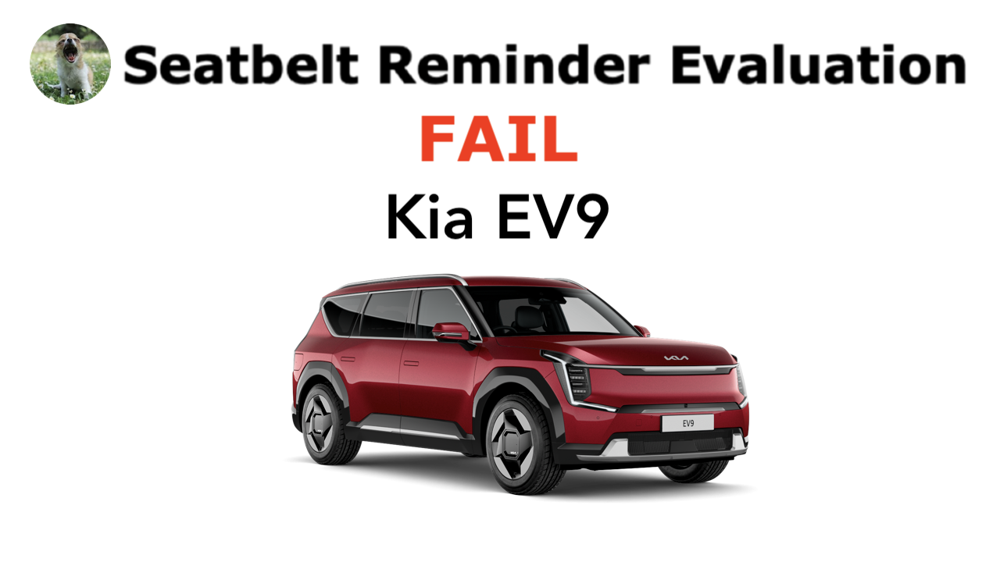

# India-spec Kia EV9 fails #WhatTheBeep

**11.04.2026**

A new [#WhatTheBeep](../../whatthebeep/index.html) seatbelt reminder evaluation has been published today, with the India-spec [Kia EV9](../../whatthebeep/2026-04-11-EV9-GTLineAWD/index.html) receiving a **FAIL** result.

Despite arriving in India as a premium import, the [Kia EV9](../../whatthebeep/2026-04-11-EV9-GTLineAWD/index.html)'s SBR behaviour **does not mirror that of its global counterparts**: the India-spec version's SBR fails to notify unbelted rear occupants in common scenarios.

## Kia EV9 evaluation explained

Based on its documentation, the India-spec EV9's rear seats appear to skip out on occupant detection sensors, and as a result, its SBR only issues an audio signal when a rear seatbelt is *fastened and then unfastened* on the move. As a result, the India-spec EV9 receives a **FAIL** result.

## Kia EV9 (India)
**Behaviour of second-level warning in the 2nd-row outboard seats**

| Testcase | Description | Audible warning | Verdict |
| --- | --- | --- | --- |
|  | occupant does not fasten seatbelt | **NO** | **NOT OK** |
|  | occupant takes off seatbelt | **YES** | **OK** |
|  | seatbelt not fastened on an empty seat | **NO** | **OK** |
|  | seatbelt taken off on an empty seat | **YES** | **NOT OK** |
|  |  |  | **FAIL** |

## Double standard: European EV9 has occupant detection

Importantly, the EV9's documentation reveals that **EV9 versions destined for Europe and Australasia demonstrate superior seatbelt reminder behaviour and have occupant detection in the rear outboard seats**, likely because this is a prerequisite for SBRs to score points in [Euro NCAP](https://www.euroncap.com/assessments/kia/ev9/1052/) and [ANCAP](https://www.ancap.com.au/safety-ratings/kia/ev9/fd7032).

## Kia EV9 (Europe, Australia, and New Zealand)
**Behaviour of second-level warning in the 2nd-row outboard seats**

| Testcase | Description | Audible warning |
| --- | --- | --- |
|  | occupant does not fasten seatbelt | **YES** |
|  | occupant takes off seatbelt | **YES** |
|  | seatbelt not fastened on an empty seat | **NO** |
|  | seatbelt taken off on an empty seat | **NO** |

More information about results, datasheets, sources of information, and evaluation criteria are at the following links:

- [All you need to know about #WhatTheBeep](../../whatthebeep/index.html)
- [Datasheet for Kia EV9](../../whatthebeep/2026-04-11-EV9-GTLineAWD/index.html)

-TYC

[click to go back to articles](../index.html)
