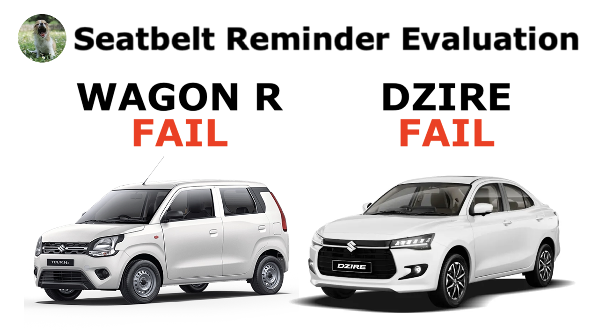

**24.05.2026**

The [Maruti Suzuki DZIRE](../../whatthebeep/2026-05-24-DZIRE-TourSSCNG/) and [Maruti Suzuki WAGON R](../../whatthebeep/2026-05-24-WAGONR-TourH3SCNG/) are the latest car models to undergo The Yawning Chihuahua's [#WhatTheBeep seatbelt reminder evaluation](../../whatthebeep/), receiving **FAIL** results today.

The latest iterations of the popular [DZIRE](../../whatthebeep/2026-05-24-DZIRE-TourSSCNG/) and [WAGON R](../../whatthebeep/2026-05-24-WAGONR-TourH3SCNG/) have seatbelt reminders as standard in all rear seats. The DZIRE and WAGON R in their "Tour S" and "Tour H3" avatars are popular taxis, and *The Yawning Chihuahua* recently had the opportunity to evaluate their rear seatbelt reminders in-person.

## Maruti Suzuki [DZIRE](../../whatthebeep/2026-05-24-DZIRE-TourSSCNG/) and [WAGON R](../../whatthebeep/2026-05-24-WAGONR-TourH3SCNG/) **FAIL** results explained

The following videos contain film demonstrating live how the [DZIRE](../../whatthebeep/2026-05-24-DZIRE-TourSSCNG/) and [WAGON R](../../whatthebeep/2026-05-24-WAGONR-TourH3SCNG/)'s rear seatbelt reminder behaves in the four test scenarios looked at in [#WhatTheBeep](../../whatthebeep/).

<iframe width="560" height="315" src="https://www.youtube.com/embed/dlN32JydcQ0?si=dEG1BEpzISriIywU" title="Embedded video" allowfullscreen></iframe>

<iframe width="560" height="315" src="https://www.youtube.com/embed/8Wi2WZb8F6M?si=b1nohSyaYlooqqzL" title="Embedded video" allowfullscreen></iframe>

As evident on film, the [DZIRE](../../whatthebeep/2026-05-24-DZIRE-TourSSCNG/) and [WAGON R](../../whatthebeep/2026-05-24-WAGONR-TourH3SCNG/)'s rear seatbelt reminders both behave purely based on belt status, and not seat occupancy. In order to avoid annoying users with false alarms (unlike the previous generation of Dzire and earlier versions of the Wagon R), the latest [DZIRE](../../whatthebeep/2026-05-24-DZIRE-TourSSCNG/) and [WAGON R](../../whatthebeep/2026-05-24-WAGONR-TourH3SCNG/) do not start an audio signal on empty seats.

However, since the rudimentary system is incapable of monitoring seat occupancy, **this behaviour comes at the cost of failing to notify even unbelted occupants**. Instead, the audio signal is only triggered when an already fastened belt is unfastened, regardless of occupancy.

## Maruti Suzuki DZIRE
**Behaviour of second-level warning in the 2nd-row outboard seats**

| Testcase | Description | Audible warning | Verdict |
| --- | --- | --- | --- |
|  | occupant does not fasten seatbelt | **NO** | **NOT OK** |
|  | occupant takes off seatbelt | **YES** | **OK** |
|  | seatbelt not fastened on an empty seat | **NO** | **OK** |
|  | seatbelt taken off on an empty seat | **YES** | **NOT OK** |
|  |  |  | **FAIL** |

## Maruti Suzuki WAGON R
**Behaviour of second-level warning in the 2nd-row outboard seats**

| Testcase | Description | Audible warning | Verdict |
| --- | --- | --- | --- |
|  | occupant does not fasten seatbelt | **NO** | **NOT OK** |
|  | occupant takes off seatbelt | **YES** | **OK** |
|  | seatbelt not fastened on an empty seat | **NO** | **OK** |
|  | seatbelt taken off on an empty seat | **YES** | **NOT OK** |
|  |  |  | **FAIL** |

More information about results, datasheets, sources of information, and evaluation criteria are at the following links:

- [All you need to know about #WhatTheBeep](../../whatthebeep/)
- [Datasheet for Maruti Suzuki DZIRE](../../whatthebeep/2026-05-24-DZIRE-TourSSCNG/)
- [Datasheet for Maruti Suzuki WAGON R](../../whatthebeep/2026-05-24-WAGONR-TourH3SCNG/)

-TYC

[click to go back to articles](../)
