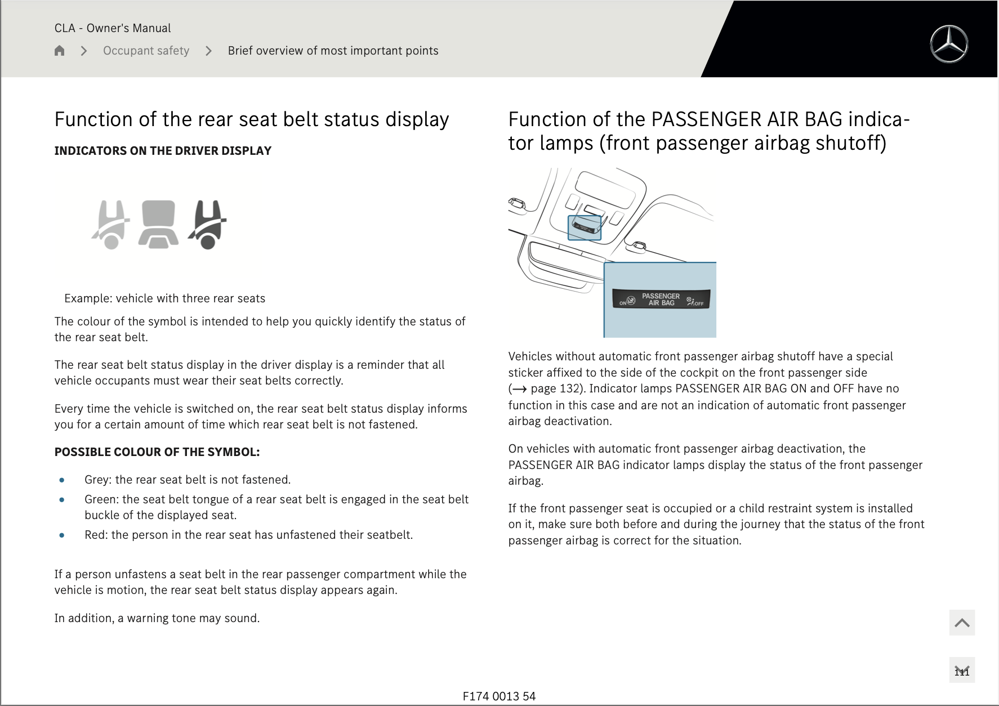
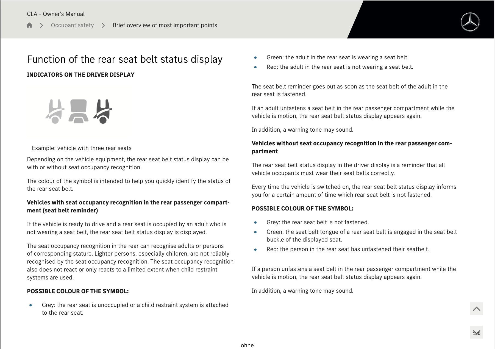

# Regional differences in Mercedes-Benz CLA ELECTRIC rear seatbelt reminder revealed in latest #WhatTheBeep evaluation

**13.06.2026**

A new [#WhatTheBeep](../../whatthebeep/index.html) seatbelt reminder evaluation has been published today, with the India-spec [Mercedes-Benz CLA ELECTRIC](../../whatthebeep/2026-06-13-CLAELECTRIC-CLA200StandardRange58kWh/index.html) receiving a **FAIL** result.

Despite arriving in India as a premium import, the [Mercedes-Benz CLA ELECTRIC](../../whatthebeep/2026-06-13-CLAELECTRIC-CLA200StandardRange58kWh/index.html)'s SBR behaviour **does not mirror that of its European counterpart**: the India-spec version lacks rear occupant detection, so its seatbelt reminder fails to notify unbelted rear occupants in common scenarios, and falsely alerts in others.

## Mercedes-Benz CLA evaluation explained

Based on [its documentation](https://www.mercedes-benz.co.in/passengercars/owners-manuals/en-in/pdf/mercedes-cla-saloon-2026-april-c174-mbux-owners-manual-1.pdf), the India-spec CLA's rear seats do not include occupant detection sensors. As a result, its rear seatbelt reminder only issues audible and visual signals when a rear seatbelt is *fastened and then unfastened* on the move, and does so regardless of whether an adult is occupying the seat or not. This behaviour causes the India-spec CLA to receive a **FAIL** result under the [#WhatTheBeep criteria](../../whatthebeep/index.html).

## Mercedes-Benz CLA (India)
**Behaviour of second-level warning in the 2nd-row outboard seats**

| Testcase | Description | Audible warning | Verdict |
| --- | --- | --- | --- |
|  | occupant does not fasten seatbelt | **NO** | **NOT OK** |
|  | occupant takes off seatbelt | **YES** | **OK** |
|  | seatbelt not fastened on an empty seat | **NO** | **OK** |
|  | seatbelt taken off on an empty seat | **YES** | **NOT OK** |

**FAIL**

## Double standard: European CLA has rear occupant detection

Importantly, a review of equivalent documentation for global models of the new CLA reveals that **CLA versions destined for Europe ([see documentation](https://www.mercedes-benz.co.uk/passengercars/owners-manuals/en-gb/pdf/mercedes-cla-saloon-2026-april-c174-mbux-owners-manual-1.pdf)) and Australia ([see documentation](https://www.mercedes-benz.com.au/passengercars/owners-manuals/en-au/pdf/mercedes-cla-saloon-2026-april-c174-mbux-owners-manual-1.pdf)) demonstrate superior seatbelt reminder behaviour and have occupant detection in the rear outboard seats**.

| India-spec | International-spec |
| --- | --- |
|  |  |

*Comparison: Behaviour of rear seatbelt reminder of India-spec CLA (left) vs UK-spec CLA (right).*

Occupant detection for the rear seatbelt reminder is a prerequisite for SBRs to score points in Euro NCAP and ANCAP, where the CLA won [Best Performer 2025](https://www.euroncap.com/press-media/euro-ncap-names-best-in-class-cars-tested-in-2025/).

## Mercedes-Benz CLA (Europe and Australia)
**Behaviour of second-level warning in the 2nd-row outboard seats**

| Testcase | Description | Audible warning |
| --- | --- | --- |
|  | occupant does not fasten seatbelt | **NO** |
|  | occupant takes off seatbelt | **YES** |
|  | seatbelt not fastened on an empty seat | **NO** |
|  | seatbelt taken off on an empty seat | **NO** |

More information about results, datasheets, sources of information, and evaluation criteria are at the following links:

- [All you need to know about #WhatTheBeep](../../whatthebeep/index.html)
- [Datasheet for Mercedes-Benz CLA](../../whatthebeep/2026-06-13-CLAELECTRIC-CLA200StandardRange58kWh/index.html)

-TYC

[click to go back to articles](../index.html)
