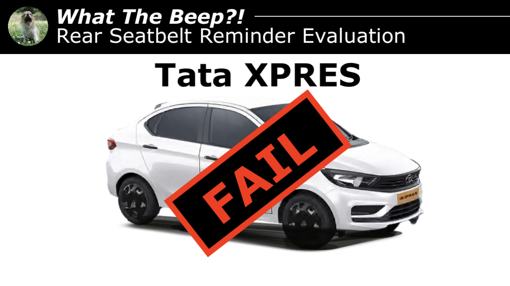

# 'Ghost' beeps from new Tata XPRES' rear seatbelt reminder earn it **FAIL** in #WhatTheBeep evaluation

**22.06.2026**

A new [#WhatTheBeep](../../whatthebeep/index.html) seatbelt reminder evaluation has been published today, with the new fleet-oriented [Tata XPRES](../../whatthebeep/2026-06-22-XPRES-12RevotronCNG/index.html) receiving a **FAIL** result.

Based on the Tigor, the new combustion-powered version of the Tata XPRES joined the existing electric XPRES-T in Tata's fleet lineup in January ([see Autocar](https://www.autocarindia.com/car-news/tata-launches-fleet-only-xpres-petrol-and-cng-variants-438889)). The Yawning Chihuahua has now had the opportunity to test its rear seatbelt reminder physically and is publishing a [#WhatTheBeep in-person evaluation](../../whatthebeep/index.html) for the [Tata XPRES](../../whatthebeep/2026-06-22-XPRES-12RevotronCNG/index.html).

## Tata XPRES evaluation explained

Like many other vehicles awarded **FAIL** under [#WhatTheBeep](../../whatthebeep/index.html), the rear seats of the [Tata XPRES](../../whatthebeep/2026-06-22-XPRES-12RevotronCNG/index.html) do not have any meaningful form of occupant detection, like pressure mats. Most of those cars start their secondary audible signals only when a rear seatbelt *becomes* unfastened.

However, the Tata XPRES presented a unique issue during testing: its final audio signal begun even when a rear seatbelt remained unfastened from the start of the trip. While this behaviour is desirable in vehicles with rear occupant detection, in a vehicle without occupant detection, this results in intrusive alerts despite the absence of rear occupants.

<iframe width="560" height="315" src="https://www.youtube.com/embed/lt-NBp1_j3E?si=xnVg_lCsKnemVvso" title="Embedded video" allowfullscreen></iframe>

## [Tata XPRES](../../whatthebeep/2026-06-22-XPRES-12RevotronCNG/index.html)
**Behaviour of second-level warning in the 2nd-row outboard seats**

| Testcase | Description | Audible warning | Verdict |
| --- | --- | --- | --- |
|  | occupant does not fasten seatbelt | **YES** | **OK** |
|  | occupant takes off seatbelt | **YES** | **OK** |
|  | seatbelt not fastened on an empty seat | **YES** | **NOT OK** |
|  | seatbelt taken off on an empty seat | **YES** | **NOT OK** |
|  |  |  | **FAIL** |

More information about results, datasheets, sources of information, and evaluation criteria are at the following links:

- [All you need to know about #WhatTheBeep](../../whatthebeep/index.html)
- [Datasheet for Tata XPRES](../../whatthebeep/2026-06-22-XPRES-12RevotronCNG/index.html)

-TYC

[click to go back to articles](../index.html)
