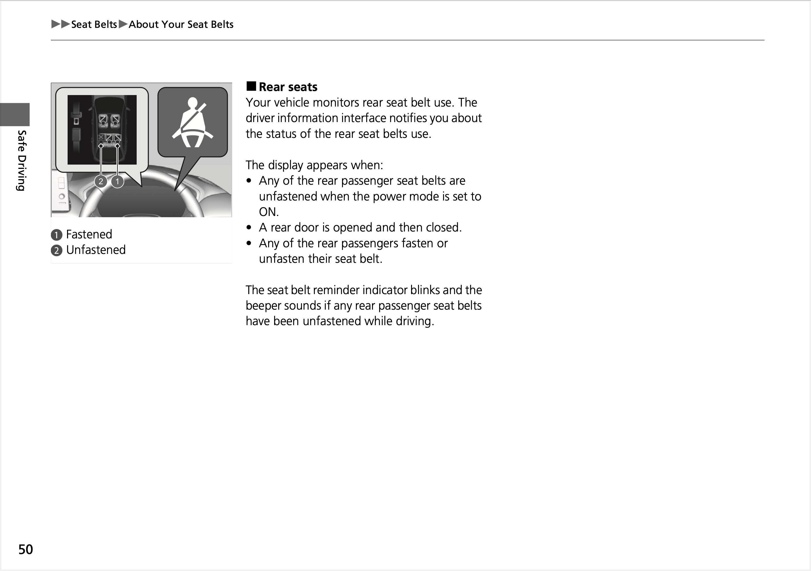
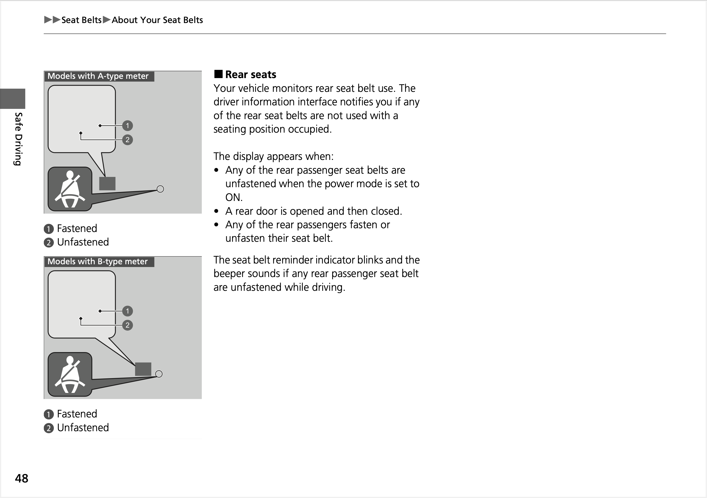

**31.07.2026**

Today, the rear seatbelt reminder of the recently launched India-spec [Honda ZR-V e:HEV](../../whatthebeep/2026-07-31-ZRVeHEV-EX20iMMD/index.html) has received a **FAIL** result in a [#WhatTheBeep](../../whatthebeep/index.html) desktop evaluation based on its user manual.

## Honda ZR-V evaluation explained

Based on [its documentation](https://honda-content-prod.s3.ap-south-1.amazonaws.com/web-data/brochures/pdfs/user-manual/All%20New%20ZR-V%20eHEV%202026.pdf), the rear seats of the India-spec ZR-V monitor only belt fastening status, but not occupancy. The ZR-V issues an audible signal when any rear seatbelt is *unfastened* while driving.

This means the [ZR-V](../../whatthebeep/2026-07-31-ZRVeHEV-EX20iMMD/index.html) fails to audibly alert rear occupants who have been unbelted from the start (likely the majority of unbelted occupants). Also, **unlike the British model** ([see documentation](https://www.honda.co.uk/cars/owners/manuals-and-guides/honda-owners-manuals/_jcr_content/par1/textcolumnwithimagem_1246050255/textColumn/richtextdownload_da5/file.res/26%20ZR-V%20HEV%20GHAC%20(KE%20KG)-323V56210_web.pdf)), which monitors rear seat occupancy, the India-spec ZR-V can also falsely alert if a belt is taken off on an empty seat (for instance, if an outboard occupant accidentally attempts to use the centre buckle). Both of these individually are sufficient conditions for a **FAIL** under the [#WhatTheBeep](../../whatthebeep/index.html) evaluation criteria.

## [Honda ZR-V (India)](../../whatthebeep/2026-07-31-ZRVeHEV-EX20iMMD/index.html)
**Behaviour of second-level warning in the 2nd-row outboard seats**

| Testcase | Description | Audible warning | Verdict |
| --- | --- | --- | --- |
|  | occupant does not fasten seatbelt | **NO** | **NOT OK** |
|  | occupant takes off seatbelt | **YES** | **OK** |
|  | seatbelt not fastened on an empty seat | **NO** | **OK** |
|  | seatbelt taken off on an empty seat | **YES** | **NOT OK** |
|  |  |  | **FAIL** |

## Double standard: British ZR-V has rear occupant detection

Importantly, a review of equivalent documentation for global models of the new ZR-V reveals that **ZR-V versions destined for the United Kingdom ([see documentation](https://www.honda.co.uk/cars/owners/manuals-and-guides/honda-owners-manuals/_jcr_content/par1/textcolumnwithimagem_1246050255/textColumn/richtextdownload_da5/file.res/26%20ZR-V%20HEV%20GHAC%20(KE%20KG)-323V56210_web.pdf)) demonstrate superior seatbelt reminder behaviour and have occupant detection in the rear outboard seats**.

| India-spec | International-spec |
| --- | --- |
|  |  |

*Comparison: Behaviour of rear seatbelt reminder of India-spec ZR-V (left) vs UK-spec ZR-V (right).*

Occupant detection for the rear seatbelt reminder is a prerequisite for SBRs to score points in Euro NCAP, where the ZR-V received [four stars in 2023](https://preview.thenewsmarket.com/Previews/NCAP/DocumentAssets/654651.pdf).

## Honda ZR-V (United Kingdom)
**Behaviour of second-level warning in the 2nd-row outboard seats**

| Testcase | Description | Audible warning |
| --- | --- | --- |
|  | occupant does not fasten seatbelt | **NO** |
|  | occupant takes off seatbelt | **YES** |
|  | seatbelt not fastened on an empty seat | **NO** |
|  | seatbelt taken off on an empty seat | **NO** |

More information about results, datasheets, sources of information, and evaluation criteria are at the following links:

- [All you need to know about #WhatTheBeep](../../whatthebeep/index.html)
- [Datasheet for Honda ZR-V](../../whatthebeep/2026-07-31-ZRVeHEV-EX20iMMD/index.html)

-TYC

[click to go back to articles](../index.html)
