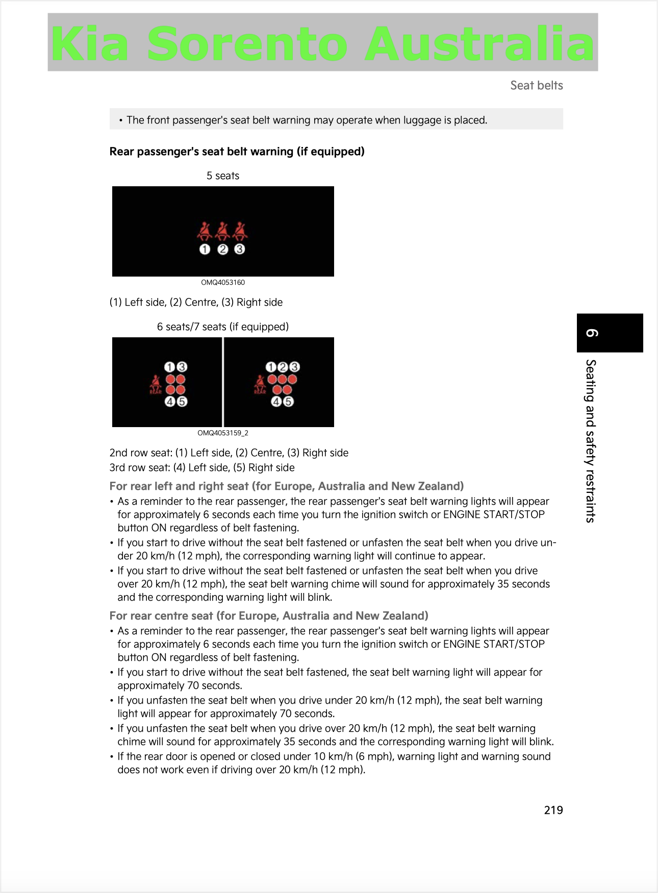
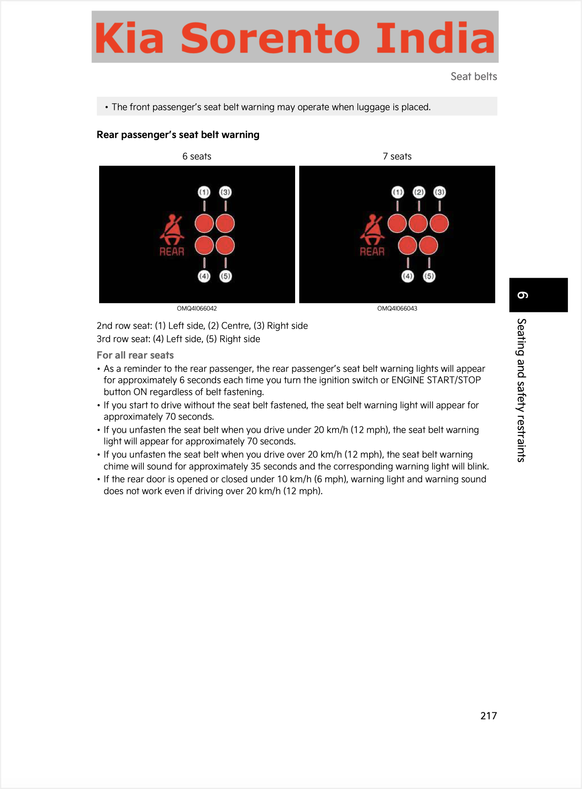

**09.09.2026**

10. That's the number of airbags you can have in the Kia Sorento, a new global SUV launched into the Indian market last week. This includes curtain and rear-seat side airbags to protect rear seat occupants.

However, these airbags can be expected to be of little good if rear occupants are not wearing their seatbelts, which is exactly why The Yawning Chihuahua is disappointed to announce that the India-spec [Kia SORENTO](../../whatthebeep/2026-09-09-SORENTO-HTE7SmartstreamD22/) today receives **FAIL** in a new [#WhatTheBeep](../../whatthebeep/) desktop evaluation.

Despite being positioned in India as a "[global icon](https://www.kia.com/in/our-vehicles/sorento/showroom.html#:~:text=of%20the%20Global%20Icon)", the [Kia SORENTO](../../whatthebeep/2026-09-09-SORENTO-HTE7SmartstreamD22/)'s rear seatbelt reminder **does not mirror that of its global counterpart**, failing to audibly alert unbelted rear occupants in common scenarios.

## Kia SORENTO evaluation explained

Based on its documentation, the India-spec SORENTO only chimes when a rear seatbelt is *unfastened* while driving above a certain speed, and not when an occupant has simply not fastened their belt. As a result, the India-spec SORENTO receives a **FAIL** result under the simple #WhatTheBeep criteria.

## [Kia SORENTO (India)](../../whatthebeep/2026-09-09-SORENTO-HTE7SmartstreamD22/)
**Behaviour of second-level warning in the 2nd-row outboard seats**

| Testcase | Description | Audible warning | Verdict |
| --- | --- | --- | --- |
|  | occupant does not fasten seatbelt | **NO** | **NOT OK** |
|  | occupant takes off seatbelt | **YES** | **OK** |
|  | seatbelt not fastened on an empty seat | **NO** | **OK** |
|  | seatbelt taken off on an empty seat | **YES** | **NOT OK** |
|  |  |  | **FAIL** |

## Double standard: Australian SORENTOES have more effective reminder than Indian SORENTOES

Importantly, investigation of the [Australian SORENTO's documentation](https://www.kia.com/content/dam/kwcms/au/en/files/owners-manuals/sorento/kia-sorento-mq4pe-ice-owners-manual-my27.pdf) reveals that **SORENTOES destined for Australasia demonstrate superior seatbelt reminder behaviour**, likely because this is a prerequisite for SBRs to score points in [Euro NCAP](https://www.euroncap.com/assessments/kia/ev9/1052/) and [ANCAP](https://www.ancap.com.au/safety-ratings/kia/ev9/fd7032). The Australian Sorento chimes not only when a rear seatbelt is *unfastened* while driving, but also when driven with a rear occupant unbelted. This is likely due to having occupant detection in the outboard seats, as its [2020 ANCAP result](https://cdn.ancap.com.au/app/public/assets/4512756d92eada2c7c7e052329a749e0fa654e94/original.pdf?1705637482) confirms.

*Comparison of the owners' manuals for Australian and Indian Sorentoes reveals a difference in the behaviour of their rear seatbelt reminders.*

## Kia SORENTO (Australia)
**Behaviour of second-level warning in the 2nd-row outboard seats**

| Testcase | Description | Audible warning |
| --- | --- | --- |
|  | occupant does not fasten seatbelt | **YES** |
|  | occupant takes off seatbelt | **YES** |
|  | seatbelt not fastened on an empty seat | **NO** |
|  | seatbelt taken off on an empty seat | **NO** |

More information about results, datasheets, sources of information, and evaluation criteria are at the following links:

- [All you need to know about #WhatTheBeep](../../whatthebeep/)
- [Datasheet for Kia SORENTO](../../whatthebeep/2026-09-09-SORENTO-HTE7SmartstreamD22/)

-TYC

[click to go back to articles](../)
