[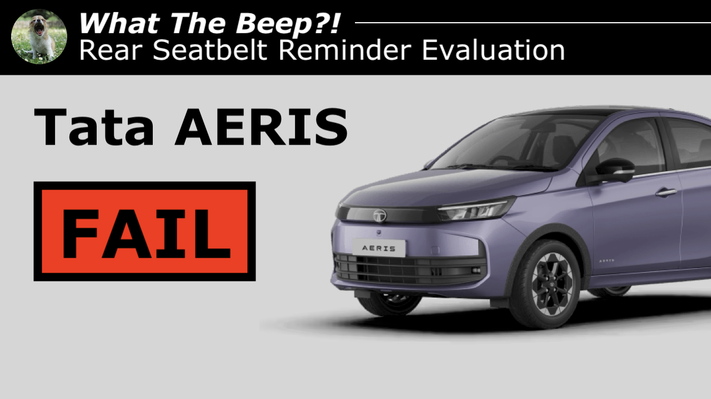](N202609301/index.html)
30.09.2026 **NOTICE** | [Tata Aeris' rear seatbelt reminder awarded FAIL in #WhatTheBeep evaluation](N202609301/index.html)

[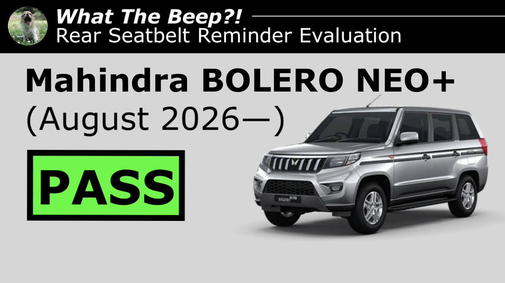](N202609291/index.html)
29.09.2026 **NOTICE** | [No Excuses: Mahindra BOLERO NEO PLUS gains intelligent rear seatbelt reminder](N202609291/index.html)

[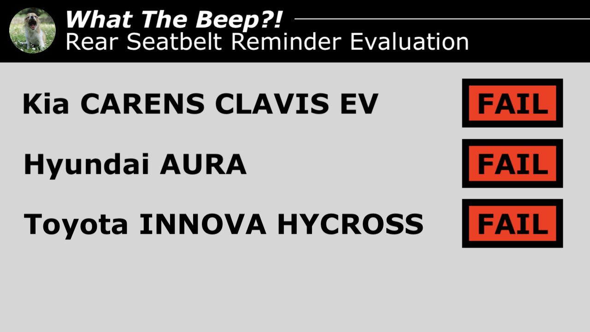](N202609181/index.html)
18.09.2026 **NOTICE** | [Three more Indian cars criticised for weak rear seatbelt reminders in latest #WhatTheBeep evaluations](N202609181/index.html)

[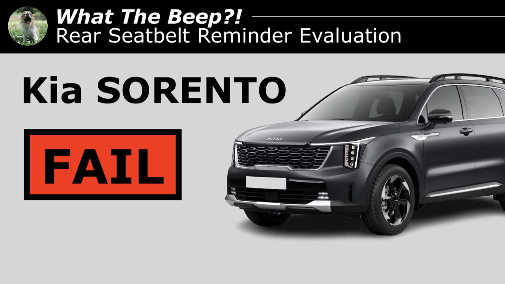](N202609091/index.html)
09.09.2026 **NOTICE** | [SORENTO becomes next India-spec Kia stripped of enhanced rear seatbelt reminder system from global model](N202609091/index.html)

[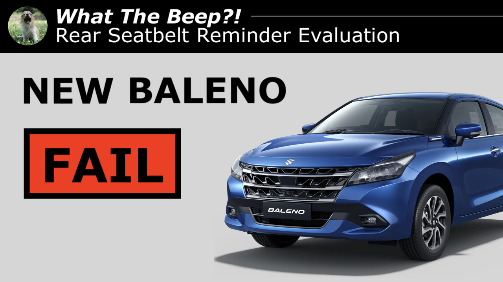](N202609081/index.html)
08.09.2026 **NOTICE** | [Maruti Suzuki continues streak of poor rear seatbelt reminders with New Baleno](N202609081/index.html)

[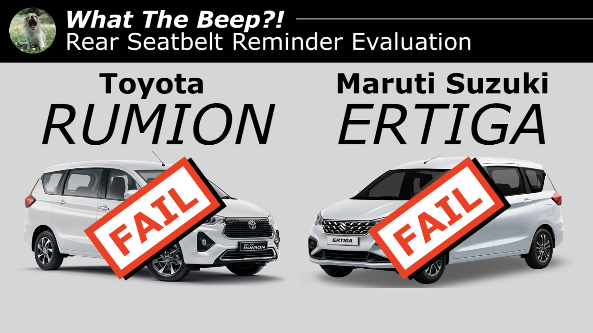](N202608281/index.html)
28.08.2026 **NOTICE** | [FAIL for Ertiga and Rumion's sad excuse for a rear seatbelt reminder — #WhatTheBeep](N202608281/index.html)

[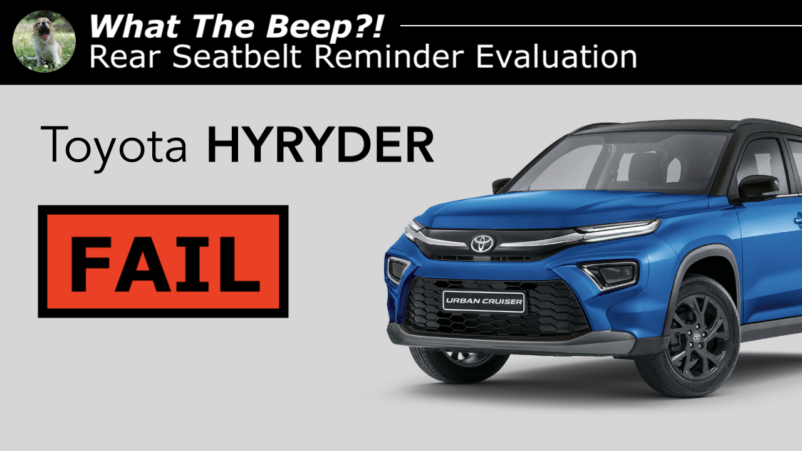](N202608211/index.html)
21.08.2026 **NOTICE** | [Toyota's popular Hyryder SUV awarded FAIL in the simple #WhatTheBeep rear seatbelt reminder test](N202608211/index.html)

[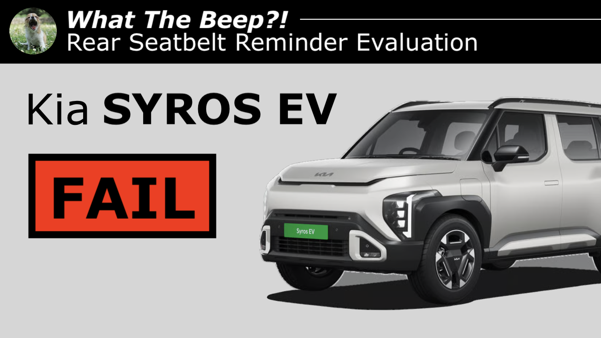](N202608051/index.html)
05.08.2026 **NOTICE** | [Kia Syros EV rear seatbelt reminder fails to do the one thing it's supposed to](N202608051/index.html)

[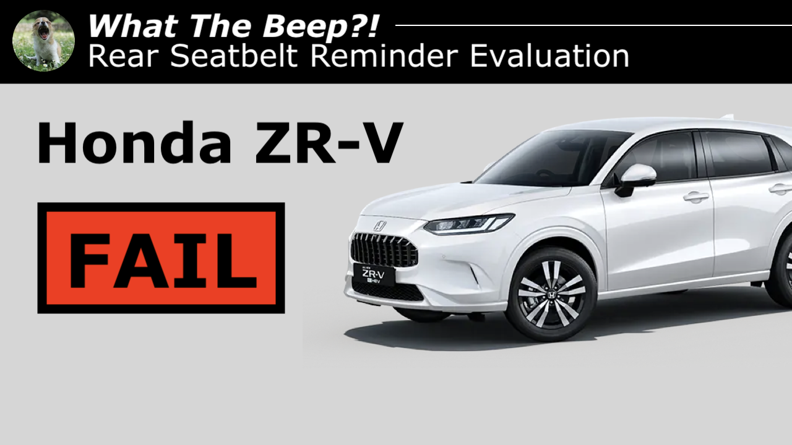](N202607311/index.html)
31.07.2026 **NOTICE** | [India-spec Honda ZR-V rear seatbelt reminder evaluated under #WhatTheBeep](N202607311/index.html)

[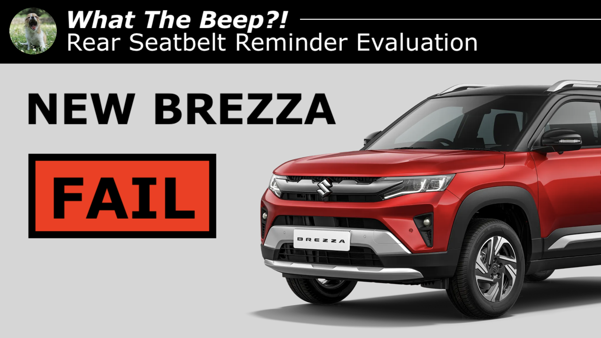](N202607291/index.html)
29.07.2026 **NOTICE** | [Maruti Suzuki's new Brezza is here — is its rear seatbelt reminder any good?](N202607291/index.html)

[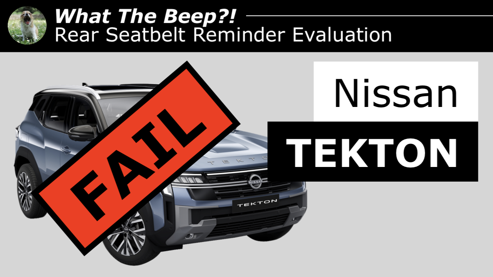](N202607171/index.html)
17.07.2026 **NOTICE** | [Nissan Tekton rear seatbelt reminder earns FAIL in #WhatTheBeep evaluation](N202607171/index.html)

22.06.2026 **NOTICE** | ["Ghost" beeps from new Tata XPRES rear seatbelt reminder earn it <b>FAIL</b> in #WhatTheBeep evaluation](N202606221/index.html)

[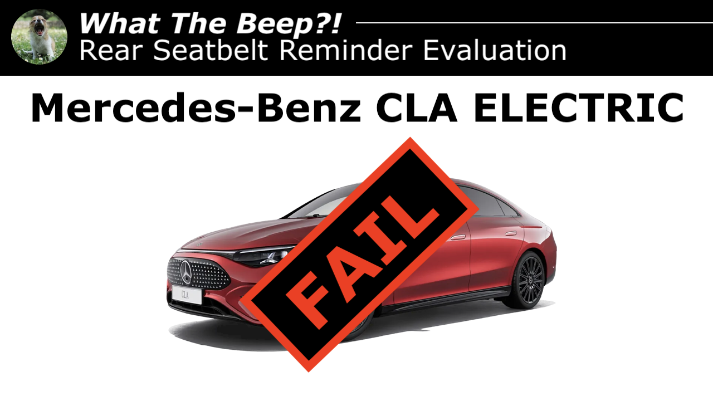](N202606131/index.html)
13.06.2026 **NOTICE** | [Regional differences in Mercedes-Benz CLA ELECTRIC rear seatbelt reminder revealed in latest #WhatTheBeep evaluation](N202606131/index.html)

[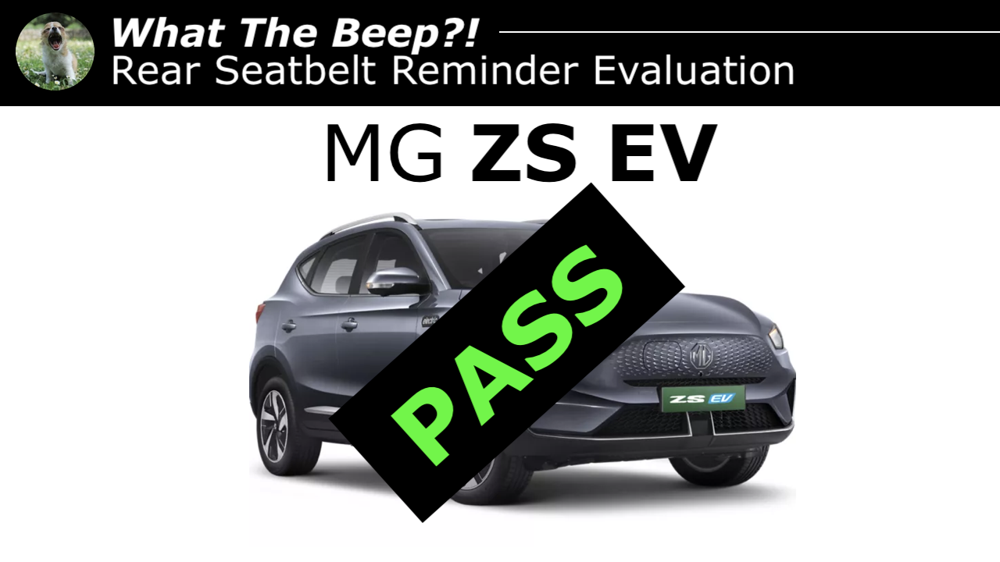](N202606091/index.html)
09.06.2026 **NOTICE** | [Success for MG ZS EV in '#WhatTheBeep' rear seatbelt reminder evaluation](N202606091/index.html)

[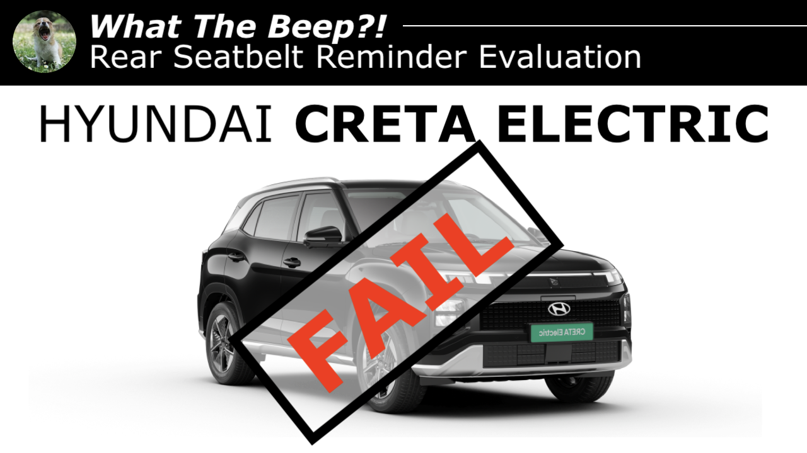](N202606051/index.html)
05.06.2026 **NOTICE** | [Hyundai CRETA ELECTRIC fails #WhatTheBeep rear seatbelt reminder evaluation](N202606051/index.html)

[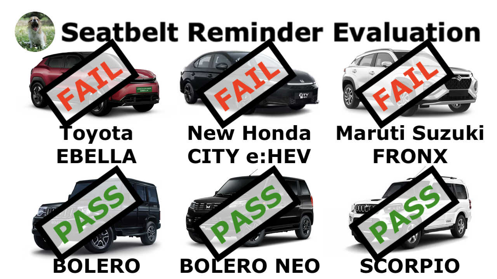](N202606011/index.html)
01.06.2026 **NOTICE** | [What The Beep?! FAIL for Toyota EBELLA and Honda CITY e:HEV while legacy Mahindras pass rear seatbelt reminder evaluation](N202606011/index.html)

24.05.2026 **NOTICE** | [Maruti Suzuki WAGON R and DZIRE rear seatbelt reminders evaluated in-person in latest #WhatTheBeep evaluation](N202605241/index.html)

[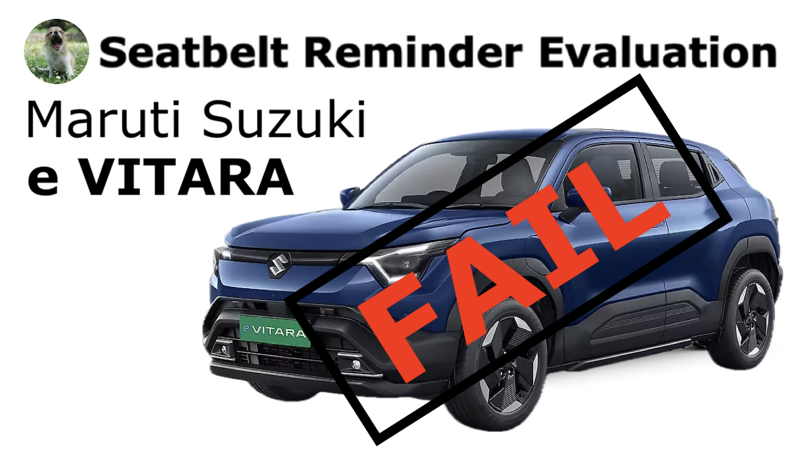](N202605221/index.html)
22.05.2026 **NOTICE** | [FAIL for Maruti Suzuki e VITARA in #WhatTheBeep](N202605221/index.html)

[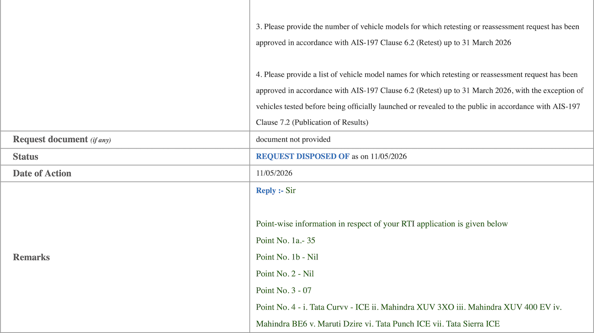](B202605121/index.html)
12.05.2026 **BLOG POST** | [RTI reveals BNCAP retested 7 cars before publishing results](B202605121/index.html)

11.04.2026 **NOTICE** | [India-spec Kia EV9 fails #WhatTheBeep](N202604111/index.html)

[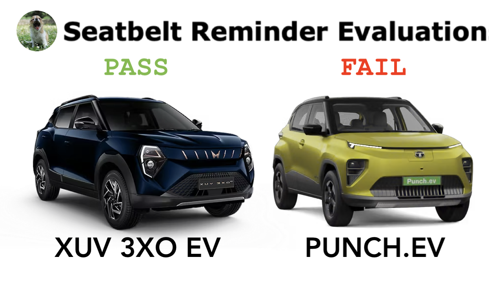](N202604101/index.html)
10.04.2026 **NOTICE** | [Two Indian EVs in #WhatTheBeep seatbelt reminder evaluation](N202604101/index.html)

[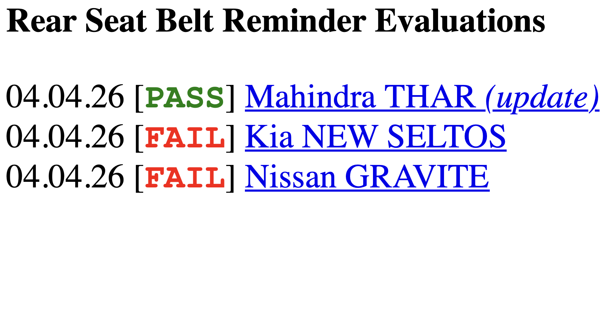](N202604041/index.html)
04.04.2026 **NOTICE** | ["New Kia Seltos and Nissan Gravite in latest #WhatTheBeep seatbelt reminder results#](N202604041/index.html)

[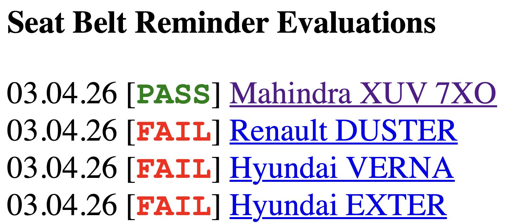](N202604031/index.html)
03.04.2026 **NOTICE** | [#WhatTheBeep seatbelt reminder evaluations of XUV 7XO, DUSTER, VERNA and EXTER published](N202604031/index.html)

03.04.2026 **BLOG POST** | [The Yawning Chihuahua launches new website](B202604031/index.html)

[Back to home](../index.html)
