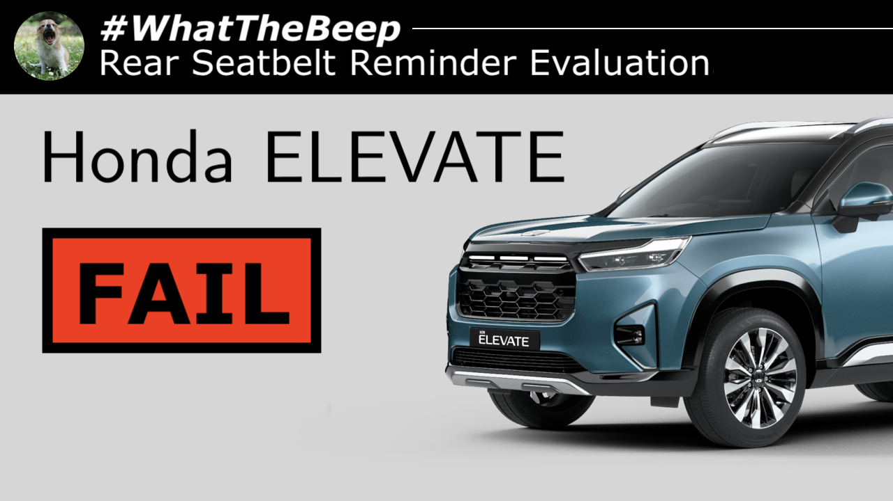

## Latest articles

07.10.2026 **NOTICE** • [Honda fail to 'Elevate' rear seatbelt reminder in facelifted SUV](articles/N202610071/index.html)

| | | |
| --- | --- | --- |
| 30.09.2026 **NOTICE** • [Tata Aeris' rear seatbelt reminder awarded FAIL in #WhatTheBeep evaluation](articles/N202609301/index.html) | 29.09.2026 **NOTICE** • [No Excuses: Mahindra BOLERO NEO PLUS gains intelligent rear seatbelt reminder](articles/N202609291/index.html) | 18.09.2026 **NOTICE** • [Three more Indian cars criticised for weak rear seatbelt reminders in latest #WhatTheBeep evaluations](articles/N202609181/index.html) |

[View more](articles/index.html)

## Latest #WhatTheBeep results

- 07.10.26 [Honda ELEVATE (*)](whatthebeep/2026-10-07-ELEVATE-SV15iVTEC/index.html) — **FAIL**
- 30.09.26 [Tata AERIS (*)](whatthebeep/2026-09-30-AERIS-Smart12Revotron/index.html) — **FAIL**
- 29.09.26 [Mahindra BOLERO NEO PLUS (*)](whatthebeep/2026-09-29-BOLERONEOPLUS-P420mHawk/index.html) — **PASS**
- 18.09.26 [Toyota INNOVA HYCROSS](whatthebeep/2026-09-18-INNOVAHYCROSS-ZX20Hybrid/index.html) — **FAIL**

[View more](whatthebeep/index.html)
