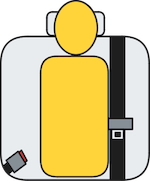
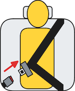
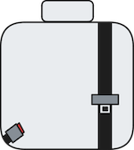
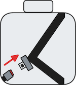

# Maruti Suzuki WAGON R

### Tour H3 S-CNG • Evaluated on 24.05.26

# **FAIL**

## Datasheet

| Testcase                         | Description                              | Audible warning*                               | Verdict                                     |
|----------------------------------|------------------------------------------|------------------------------------------------|---------------------------------------------|
|  | occupant does not fasten seatbelt        | **NO**        | **NOT OK** |
|  | occupant takes off seatbelt              | **YES**     | **OK**   |
|  | seatbelt not fastened on an empty seat   | **NO**      | **OK**   |
|  | seatbelt taken off on an empty seat      | **YES**       | **NOT OK** |
|                                  |                                          |                                                | **FAIL**   |

*second row outboard seat

## Information Source

### Source Type
in-person testing

### Test & Vehicle Details

| Field              | Details                                                      |
| ------------------ | ------------------------------------------------------------ |
| TEST ID            | WTB240526MWA1                                                |
| TEST ADMINISTRATOR | The Yawning Chihuahua                                        |
| TEST DATE          | 24 May 2026                                                  |
| TEST LOCATION      | Bengaluru                                                    |
| MODEL              | Maruti WagonR Tour H3 CNG                                    |
| REGISTRATION       | KA01AN8298                                                   |
| REGISTRATION DATE  | 13 June 2025                                                 |

### Video

<iframe width="560" height="315" src="https://www.youtube.com/embed/8Wi2WZb8F6M?si=b1nohSyaYlooqqzL" title="YouTube video player" allowfullscreen></iframe>

### Manual URL
[link to manufacturer website](https://az-ci-afde-prd-arena-03-efddeyfchzf9akbb.z01.azurefd.net/msilintiwebpdfcopyfromdefault/Tour_H3_99011M69RT8-74W.pdf)

### Brochure URL
[link to manufacturer website](https://az-ci-afde-prd-arena-03-efddeyfchzf9akbb.z01.azurefd.net/msilintiwebpdfcopyfromdefault/27112025WagonR_Tour_H3_Leaflet_A4.pdf)

[click to go back to #WhatTheBeep](../index.html)
